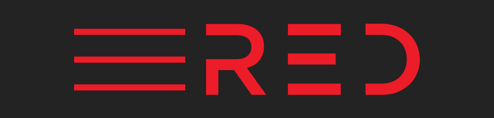

# 💸 Donation details (تفاصيل التبرع)

## Who we are?

_Red LAB_ (_The LAB_) is an experimentation and exploration hub of [_RED_](https://github.com/Red-company). We're accumulating different knowledges and making an experiments, always looking for a new information and are interested in sharing this information with other people.   

The most of our work is doing offline and now we're having a lack of work power, but we're aimed at our goals and we are moving towards them step by step, commit by commit. And sooner or later, _we will reach our goals._  

For more information visit [_donation page of RED_](https://github.com/Red-company/Donation).  

## Donation status:

If you like _Red_ projects and interested in their improvements you can help us.

At this page are presented donation details of _Red_.

Thank you for your assistance in the development of _Red_.  

## Donation details:

_Bitcoin (₿):_ bc1qnw2700l88es65yv8j9gmtk8xt0mw09dxa7dyj8

