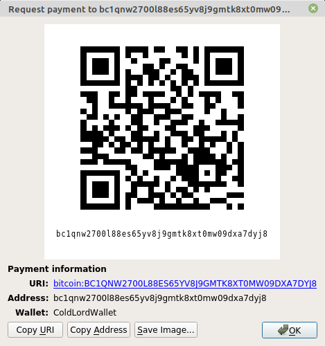

# 💸 Donation details (تفاصيل التبرع)

## Who we are?

Red LAB (The LAB) is an experimentation and exploration hub of [RED](https://github.com/Red-company). We're accumulating different knowledges and making an experiments, always looking for a new information and are interested in sharing this information with other people.   

The most of our work is doing offline and now we're having a lack of work power, but we're aimed at our goals and we are moving towards them step by step, commit by commit. And sooner or later, we will reach our goals.

## Donation status:

If you like Red projects and interested in their improvements you can help us.

At this page are presented donation details of Red.

Thank you for your assistance in the development of Red.

## Donation details:

Bitcoin (₿): bc1qnw2700l88es65yv8j9gmtk8xt0mw09dxa7dyj8

